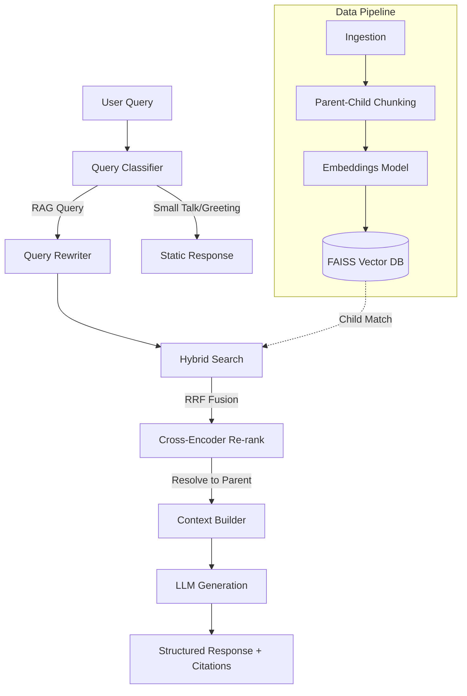

# RAG System for Local LLMs

## Project Overview

This project is a production-grade Retrieval-Augmented Generation (RAG) platform designed to enable secure, context-aware question answering over custom document corpuses. It addresses the limitation of generic Large Language Models (LLMs) by grounding generation in verifiable, locally indexed data. The system is engineered to mitigate hallucinations, provide strict source attribution, and operate efficiently with both cloud-based and local LLM providers.

## Key Highlights

- **Advanced Retrieval Strategy**: Implemented Parent-Child chunking to balance semantic search precision (small child chunks) with comprehensive context generation (large parent chunks).
- **Hybrid Search Pipeline**: Fused dense vector search (FAISS/MiniLM) with sparse keyword search (BM25) using Reciprocal Rank Fusion (RRF) to optimize recall.
- **Cross-Encoder Re-ranking**: Integrated an MS-MARCO cross-encoder to refine the top-k retrieval results, prioritizing highly relevant context.
- **Multi-Provider LLM Integration**: Engineered a Factory pattern supporting seamless switching between Gemini, OpenAI, and local Ollama inference endpoints.
- **Observability and Analytics**: Developed a structured JSON logging layer to track token usage, generation latency, retrieval scores, and estimated API costs, visualized via a Plotly-backed Streamlit dashboard.
- **Automated Evaluation Framework**: Built an automated suite to calculate standard IR metrics (Precision@K, Recall@K, MRR) and utilize LLM-as-a-judge for assessing response Groundedness and Completeness.

## System Architecture

The system follows a modular architecture separating data ingestion, vector indexing, retrieval logic, and generation.

1.  **Document Ingestion & Parsing**: Extracts text from PDF, TXT, and Markdown files using a strategy pattern.
2.  **Text Preprocessing & Chunking**: Utilizes sentence-boundary-aware splitting. Documents are segmented into Parent chunks (2000 chars) which are subdivided into Child chunks (400 chars).
3.  **Embedding Generation**: Converts Child chunks into 384-dimensional dense vectors using `all-MiniLM-L6-v2`.
4.  **Vector Indexing**: Stores embeddings in a persistent FAISS `IndexFlatIP` database, mapping child vectors to parent metadata.
5.  **Retrieval Pipeline**: A user query triggers parallel BM25 and Vector searches. Results are fused via RRF, re-ranked via a Cross-Encoder, and resolved to their Parent chunks.
6.  **Response Generation**: An LLM (via the Factory provider) synthesizes the final answer using the retrieved Parent chunks, enforcing strict source attribution.



## Technical Features

- PDF, TXT, and Markdown support
- Parent-Child hierarchical text chunking
- FAISS dense vector indexing
- BM25 sparse retrieval
- Reciprocal Rank Fusion (RRF)
- MS-MARCO Cross-Encoder re-ranking
- Query intent classification
- Multi-LLM support (Gemini, OpenAI, Ollama)
- JSON-based Observability logging
- Streamlit interactive UI with Analytics dashboard
- Automated Evaluation suite (Precision, Recall, MRR, Groundedness)

## Technology Stack

- **AI/LLM**: Google Gemini SDK, OpenAI SDK, Ollama, SentenceTransformers (MiniLM, Cross-Encoder)
- **Backend**: Python 3.11+, Dataclasses, ABC Interfaces
- **Vector Database**: FAISS (Facebook AI Similarity Search)
- **Search**: Rank-BM25
- **Data Processing**: PyPDF, Regex
- **Deployment**: Docker, Docker Compose, Streamlit

## Project Structure

```text
├── app.py                  # Main Streamlit application entry point
├── config.py               # Centralized configuration and parameters
├── docker-compose.yml      # Container orchestration
├── Dockerfile              # Application container image definition
├── requirements.txt        # Python dependencies
├── data/                   # Raw document storage
├── docs/                   # Detailed architectural documentation
├── evaluation/             # Automated benchmarking suite
│   ├── benchmark_dataset.json
│   ├── metrics.py
│   ├── retrieval_eval.py
│   └── answer_eval.py
├── monitoring/             # System telemetry and JSONL logs
├── src/                    # Core application logic
│   ├── analytics_page.py   # Plotly dashboard implementation
│   ├── chunking.py         # Parent-child text splitting
│   ├── classifier.py       # Query intent router
│   ├── embeddings.py       # HuggingFace model wrapper
│   ├── generator.py        # LLM Factory and generation orchestration
│   ├── ingestion.py        # Document parsing
│   ├── observability.py    # Structured logging
│   ├── prompts.py          # LLM instruction templates
│   ├── retriever.py        # Hybrid search and RRF logic
│   ├── utils.py            # Helper functions
│   └── vector_store.py     # FAISS database operations
└── vector_db/              # Persistent FAISS index storage
```

## Installation Guide

### Prerequisites
- Python 3.11 or higher
- Docker (optional, for containerized deployment)

### Local Setup

1.  **Clone the repository:**
    ```bash
    git clone https://github.com/sudeshsudhii/RAG-SYSTEM-FOR-LOCAL-LLM.git
    cd RAG-SYSTEM-FOR-LOCAL-LLM
    ```

2.  **Create and activate a virtual environment:**
    ```bash
    python -m venv venv
    # Windows
    .\venv\Scripts\activate
    # Linux/Mac
    source venv/bin/activate
    ```

3.  **Install dependencies:**
    ```bash
    pip install -r requirements.txt
    ```

4.  **Configure Environment Variables:**
    Create a `.env` file in the root directory:
    ```env
    GEMINI_API_KEY=your_gemini_api_key
    OPENAI_API_KEY=your_openai_api_key
    OLLAMA_BASE_URL=http://localhost:11434
    LLM_PROVIDER=gemini
    ```

5.  **Run the application:**
    ```bash
    streamlit run app.py
    ```

### Docker Setup

```bash
docker compose up -d --build
```
Access the application at `http://localhost:8501`.

## Usage Examples

1.  **Document Indexing**: Upload `sample.txt` or a PDF via the Streamlit sidebar and click "Index Documents". The system will chunk, embed, and store the text in FAISS.
2.  **Question Answering**: Enter a query like *"What is the architecture of this system?"* in the chat interface. The system will retrieve relevant parent chunks, generate an answer, and provide specific source citations (Document Name, Page).
3.  **Analytics Monitoring**: Switch to the Analytics tab to view query volume, average latency, and estimated token costs over time.

## Design Decisions

- **Parent-Child Chunking**: Chosen over standard chunking to solve the "lost in the middle" problem. Small chunks provide highly accurate semantic matches, while retrieving the parent block ensures the LLM has sufficient context to formulate a cohesive answer without hallucinating.
- **Hybrid Search (Dense + Sparse)**: Relying solely on dense embeddings can fail on exact keyword matches (e.g., specific acronyms). BM25 handles sparse keyword matching, and RRF seamlessly merges the two paradigms.
- **Factory Pattern for LLMs**: Implementing an `LLMProvider` abstract base class ensures the system is loosely coupled to any specific vendor, allowing organizations to switch to local, privacy-preserving models (Ollama) instantly.

## Challenges Solved

- **Context Window Exhaustion vs. Search Precision**: Addressed by implementing the hierarchical Parent-Child retrieval strategy.
- **Prompt Injection**: Mitigated by utilizing a `QueryClassifier` to route out-of-scope inputs and hardening the system prompt to reject overriding instructions.
- **System Observability**: RAG systems are notoriously difficult to debug. Built a custom JSON logger to intercept token counts, latency, and costs at the generation layer, exposing them via a real-time dashboard.

## Performance Considerations

- **Cross-Encoder Overhead**: Re-ranking is computationally expensive. The pipeline restricts the cross-encoder to evaluate only the top-K results returned by the faster bi-encoder/BM25 fusion step.
- **Index Optimization**: `faiss.IndexFlatIP` requires normalized vectors. Inner product operations are highly optimized for CPU execution, ensuring fast retrieval without requiring a GPU for the vector store.

## Future Enhancements

- **Distributed Vector Database**: Migrate from local FAISS to a scalable vector database like Pinecone, Milvus, or Qdrant for enterprise-scale corpuses.
- **GraphRAG Integration**: Incorporate knowledge graphs to map entity relationships for complex, multi-hop reasoning queries.
- **Asynchronous Processing**: Implement Celery/Redis for background document processing to prevent UI blocking during massive ingestions.

## Resume Impact

This project demonstrates practical competency in the following areas:

- **Generative AI & LLMs**: Prompt engineering, context window management, and multi-model API integration.
- **RAG Architecture**: Advanced chunking strategies, hybrid retrieval pipelines, and Re-ranking techniques.
- **Information Retrieval (IR)**: Vector similarity search (FAISS), sparse retrieval (BM25), and standard IR evaluation metrics.
- **System Design**: Interface-driven development (Factory patterns), modularity, and separation of concerns.
- **Python Backend Engineering**: Type hinting, dataclasses, abstract base classes, and environment configuration.
- **Production Practices**: Structured logging, telemetry dashboards, automated benchmarking, and Docker containerization.
